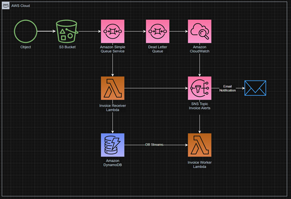

# Title: Event driven serverless pipeline for invoice processing – Terraform project.

## Author:
Network-minded Cloud Engineer dedicated to the philosophy that 'discipline equals freedom.' Specializing in event-driven architectures, Python automation, and Terraform for consistent, modular deployments. I bridge the gap between traditional networking and modern cloud automation.

## About:
This project features a neatly organized, event-driven serverless pipeline designed to process invoices automatically. By leveraging Terraform, the entire infrastructure is modular and fully portable. It demonstrates a "decoupled" architecture where individual components communicate via events rather than direct dependencies, ensuring the system is resilient and scalable.

##  Use cases:

Automated Accounts Payable: A company receives hundreds of PDF/JSON invoices daily from suppliers. This pipeline ingests them into a   database for payment tracking without manual data entry.

Compliance Audit Logging: In highly regulated industries (like banking), every financial document must be logged and archived. This system creates an immutable record in DynamoDB for every file uploaded to S3.

E-commerce Order Processing: When a customer places an order, an invoice is generated. This system can trigger a "Worker" Lambda to send a confirmation email or update inventory systems.

## Resource graph:
 

## How it works:
1.	Invoices are uploaded into S3 bucket in .json format.
2.	SQS picks them up and feeds them to Lambda in batches, holding off the excess to make sure Lambda can process.
3.	If invoice doesn’t match format and is rejected by Lambda, it lands in a DLQ.
4.	DLQ upload triggers CloudWatch and an SNS Topic with email notification.
5.	Invoice Receiver Lambda processes the invoice, passes notification to SNS topic if invoice is over 500 and writes invoice into DynamoDB table.
6.	DynamoDB Streams passes the invoice to the Invoice Worker Lambda for further processing which is open for downstream layer integration to suit your use case.

## How to deploy:

To get this pipeline running in your own AWS environment:

1. Clone the Repo: Open your terminal and clone this repository to your local machine.

2. Configure Credentials: Ensure your AWS CLI is installed and configured with the necessary permissions.

3. Prepare Variables:

* Rename terraform.tfvars.example to terraform.tfvars.

* Update the file with your specific bucket names and email addresses.

4. Initialize & Deploy:

* Run terraform init to download the providers.

* Run terraform plan to verify the execution path.

* Run terraform apply to build the infrastructure.
